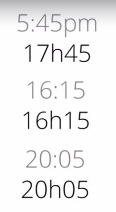

# French-Lessons
## Course 1

| English | French | Pronounciation
| --- | --- | ---|
| It is | C'est | say
| It isn't | Ce n'est pas | snepa
| Bon | Good | bon (masc)
| Fantastic | Fantastqiue | fontasteeq
| Absolutely | Absolument | absulimon
| here | ici | ici
| very | tres | trre
| Delicious | delicieux | delisia
| Extraordinary | extraordinaire | extraordinaire
| Beautiful | beau(masc)/belle(femn) | bou/bell
| For me | Pour moi | por muah
| I think | *Pour moi | por muah
| But | mais | may
| Yes | Oui | oui
| Thank you | merci | merci
| Perfect | parfait | parfay
| That | ca | sa
| That is | Ca c'est | sa say
| Always | Toujours | tujour
| For him | Pour lui | por lui
| For her | Pour elle | por el
| No | non | nau
| bad | mauvais | muvay
| The restaurant | le restaurant | lo restahan 
| isn't | n'est pas | ne pa
| is | est | eh
| everything | tout | tu
| the chicken | le poulet | lo puley (masc)
| the turkey | la dinde | la daand (femn)
| the boy | le garcon | lo garsauhn (masc)
| the girl | la fille | la feel (femn)
| terrible | terrible | terr-e-bla
| my | mon/ma | mon(masc)/ ma (femn)
| the hotel | l'hotel | lo-tell
| everybody/everyone | tout le monde | tou le monde
| nice | sympa | sampa
| a | un(masc)/une(femn) | unn/oone
| coffee | cafe | caffe
| tea | the | te
| please | sil vous plait | si vu play
| I would like | je voudrais | je vudray
| a reservation | une reservation | oone reservacion
| two people | deux personnes | deu persauunh
| a table | une table | oone taabla
| the food | la nourriture | la norritou
| and | et | eh
| also | aussi | ossey
| are | sont | saun
| are not | ne sont pas | nu saun pa
| hi | salut | salu
| hello/good day/ good morning | bonjour | bonjou
| good evening/ good afternoon | bonsoir | bonsuah
| good night | bonne nuit | bonne nui
| good bye/ till we see each other again | au revoir | au-vaah
| have a good day | bonne journee | bonne jorney
| have a good evening | bonne soiree | bonsuarey
| see you soon | a bientot | abiento

## Course 2

| English | French | Pronounciation
| --- | --- | ---|
| the bill | l'addition | ladicion
| a bottle of | une bouteille de | oon butey du
| the wine/ of wine | le vin/ de vin | lu van/ du van
| a bottle of water | une bouteille d'eau | oon butey deau (hindi pronounciation for 2)
| how much is it?/ how much is ... | c'est combien? | say combiya
| excuse me | excusex-moi | ex-cusay-mua
| the water | l'eau | lou
| (to) try | essayer | essay-ye
| can I/ may I | puis-je? | puis-jah
| (to) pay (for)| payer | peye
| (to) make | faire | feah
| (to) hire/rent | louer | luye
| a car | une voiture | oon voitueah
| a month/one month | un mois | un-muah
| a week/one week | une semaine | oon semain
| a day/one day | un jour | unjour
| euro | euro | oro
| cents | centimes | sunteme
| per | par | paar
| (at) what time..? | a quelle heure..? | a-kel-er
| the breakfast | lo petit-dejeuner | lo-peti-dejuney
| the lunch | lo dejeuner | lo-dejuney
| the dinner | lo diner | lo-diney
| at .. o'clock | a .. heures | aah .. heu
| at half past .. | a .. heures et demie | aah .. heu eh dimi
| at quarter past .. | a .. heures et quart | aah .. heu eh qaa
| in the morning | le matin | lo mataan
| in the evening | le soir | lo suar
| at quarter to ... | a .. heures moins le quart | aah .. heu moin lu qua
| what time is it? | quelle heure est-il? | kel-eur-et-eil
| it is .. o'clock | il est .. heures | eil-eh .. heures

- 'h' here denotes heures

- notice the difference 